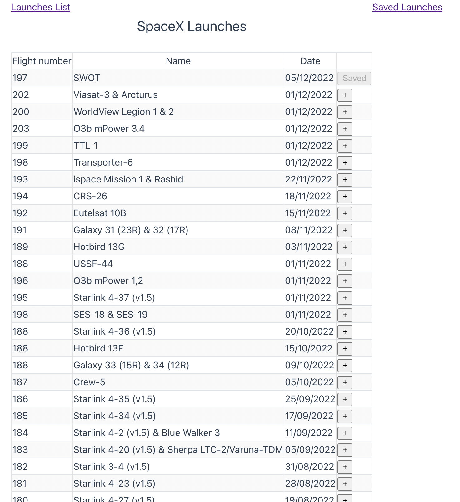
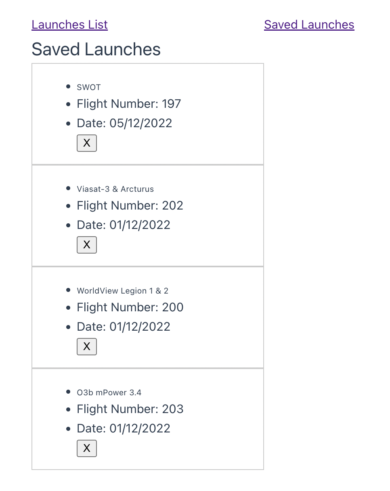

# SpaceX Launches Application

## Installation

1.  **git clone https://github.com/anuteresa/mevn-App.git**
   
## Frontend Setup 
1.  **npm install**
    <!-- Copy Button -->
3.   **npm run dev**

## Backend Setup

1. **cd spacex-backend**
2.  **npm install**
3.   **npm start**
   
  ## Output Screenshots

### 1. Launch List View

### 2. Saved Launches

